# 🛒 NovaCart

## Description

NovaCart is a Full Stack E-Commerce Web Application developed using Java Spring Boot following the MVC architecture.
It provides secure authentication, shopping cart, wishlist, coupon management, order management, invoice generation, 
email notification, Cloudinary integration, and separate Admin and User panels.

## Features

*User Registration
*Secure Login using Spring Security
*Login OTP Verification
*Forgot Password using Email OTP
*Product Management
*Category Management
*Shopping Cart
*Wishlist
*Buy Now
*Coupon & Discount System
*Order Management
*Invoice PDF Generation
*Order Confirmation Email
*Cloudinary Image Upload
*Profile Management
*Change Password
*Product Search
*Dynamic Latest Products
*Responsive UI
*Separate Admin & User Dashboard

## Technology Stack

//Backend
Java,Spring Boot,Spring MVC,Spring Security,Spring Data JPA,Hibernate
//Frontend
HTML,CSS,Bootstrap,Thymeleaf
//Database
MySQL
//Tools
Git,GitHub,Postman,Maven,Cloudinary,Java Mail

#Architecture
//MVC Diagram
Browser=>Controller=>Service=>Repository=>MySQL Database

#Screenshots

##Home Page
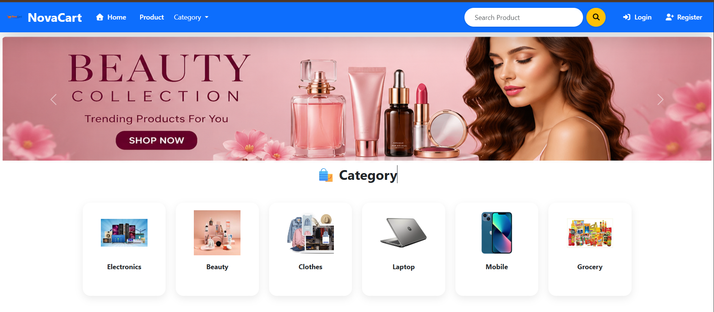

## Home Page (Featured Products)
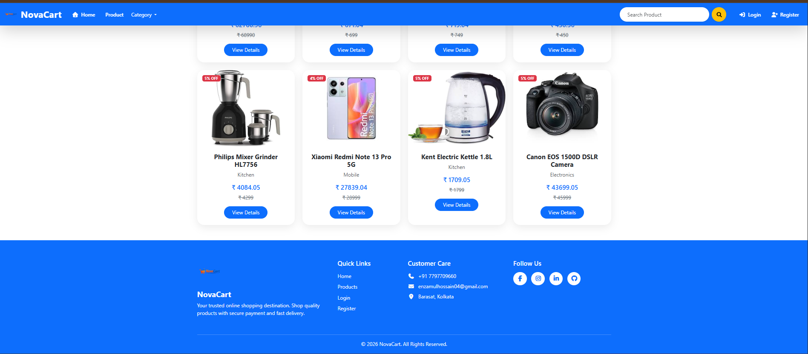

## Login Page
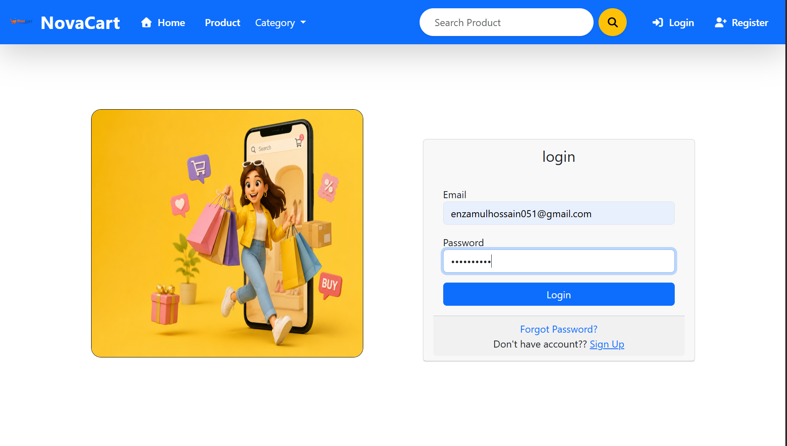

## Login OTP Verification
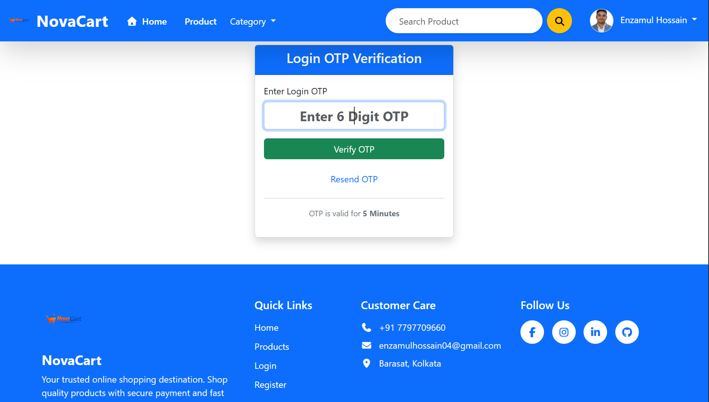

## Registration Page
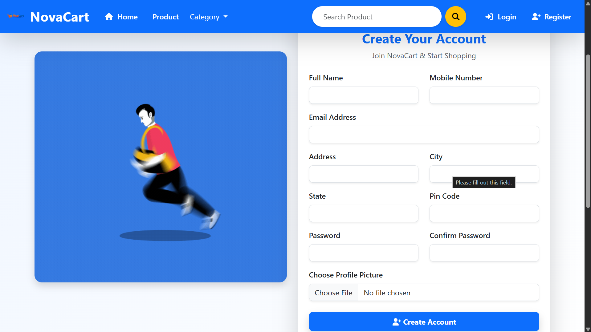

## Product List
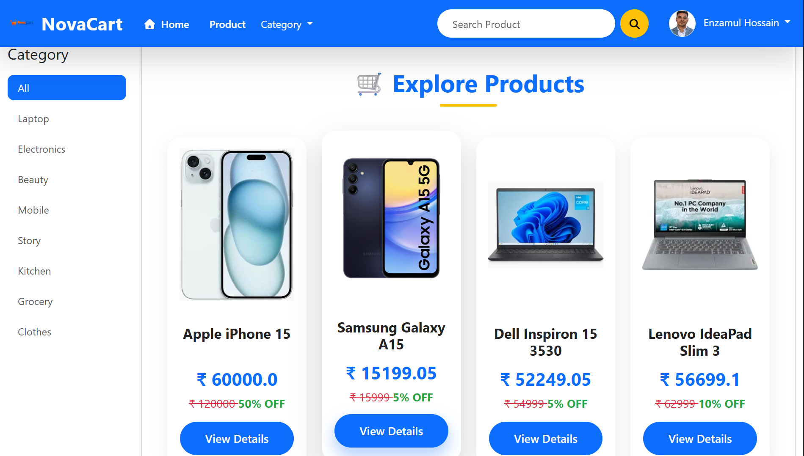

## Product Details
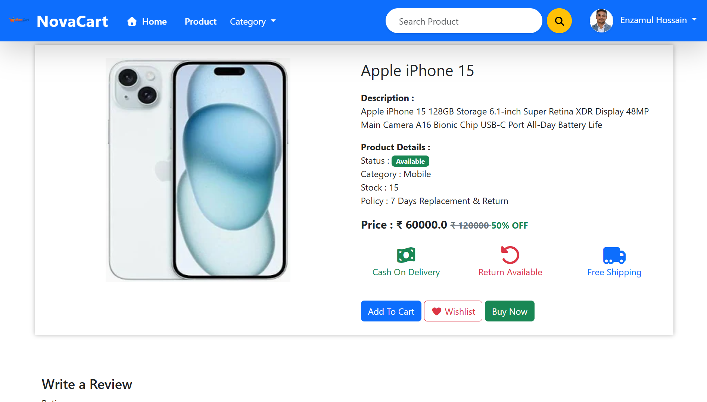

## Product Reviews
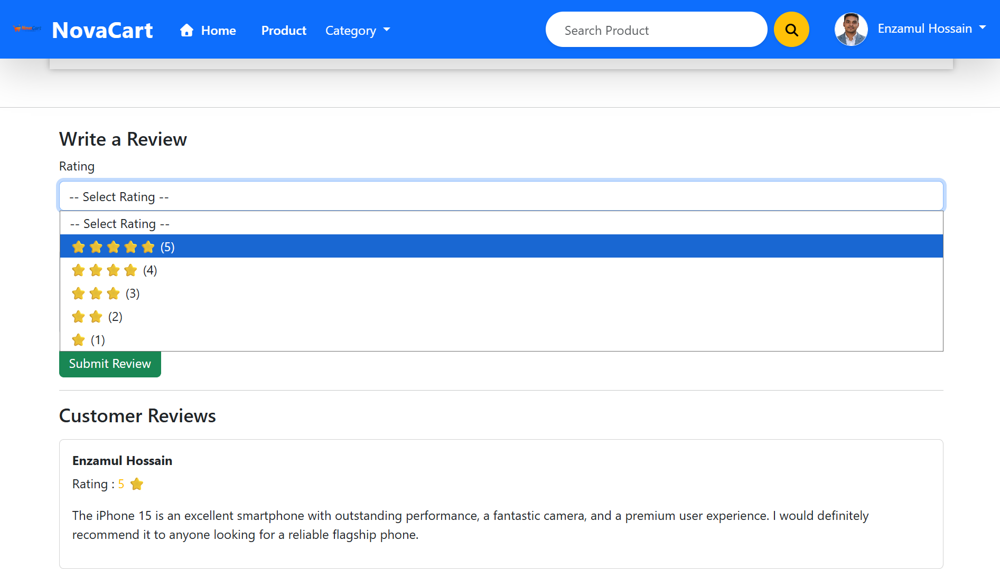

## Wishlist
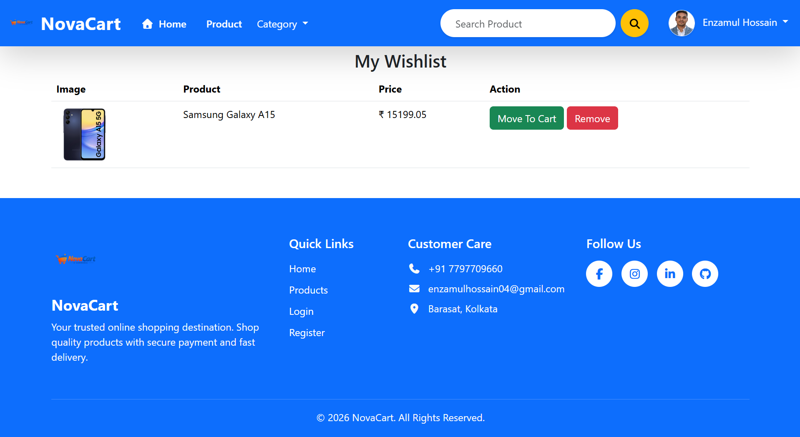

## Shopping Cart
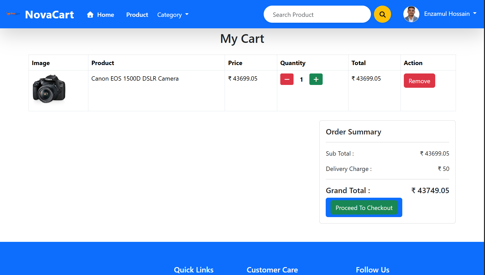

## Checkout
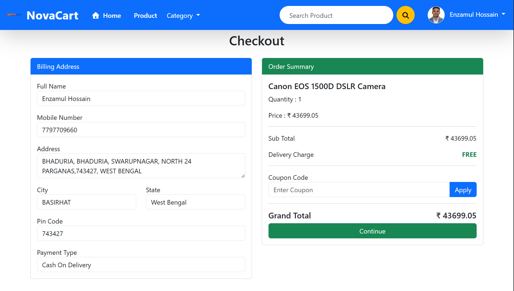

## Checkout Summary
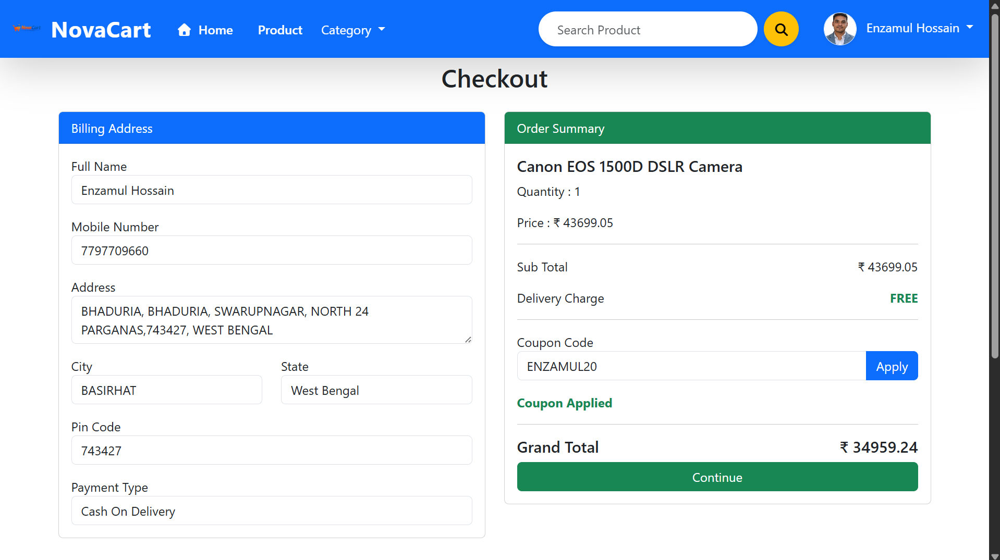

## Coupon Management
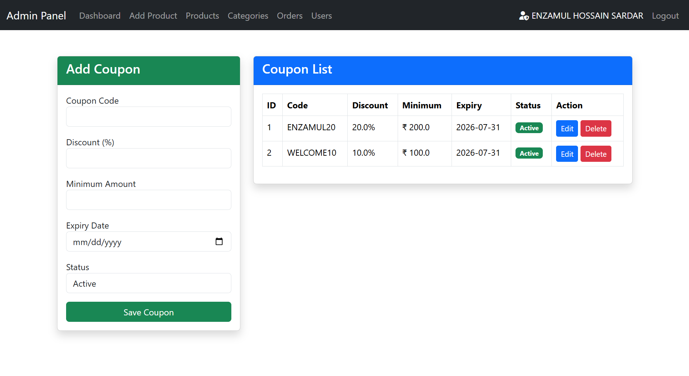

## User Profile
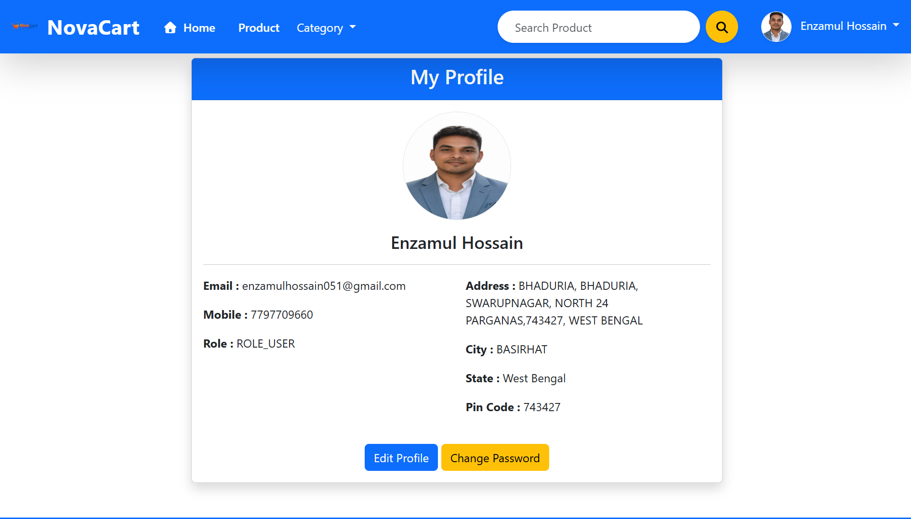

## Order Details
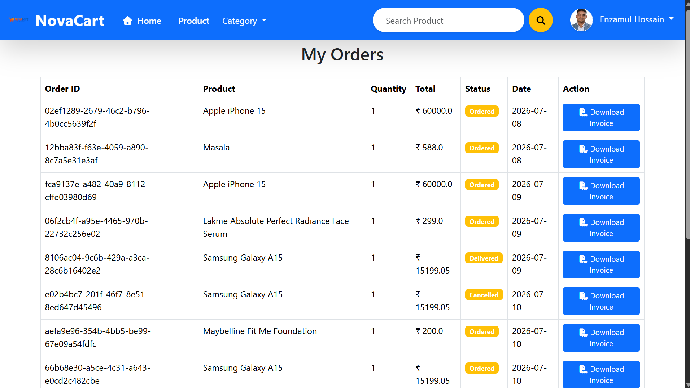

## Admin Dashboard
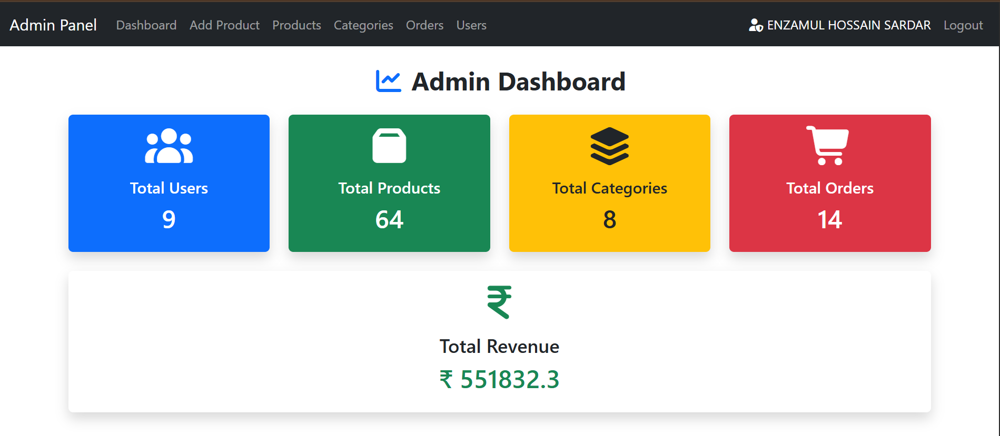

## Admin Dashboard (Analytics)
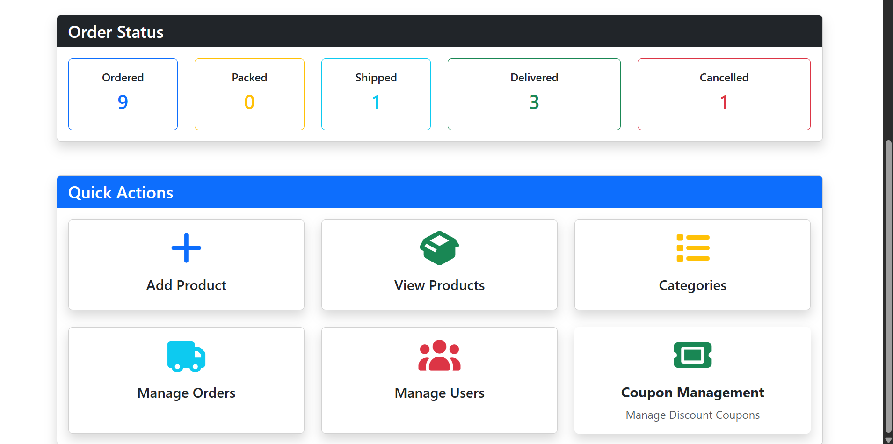

## Configuration

Update the following before running the application:

- MySQL Database Credentials
- Gmail App Password
- Cloudinary API Credentials
- Razorpay API Credentials

## Installation Guide
1. Clone the repository
2. Open in IntelliJ IDEA
3. Configure MySQL Database
4. Update application.properties
5. Run Maven
6. Start the Spring Boot application
7. Open http://localhost:8080

## Folder Structure  
src
 | controller
 |service
 |repository
 |model
 |config
 |dto
 |util
 |templates
 |static

## Future Enhancements
 
- Razorpay Payment Gateway
*JWT Authentication
*Docker Deployment
*Microservices Architecture
*Redis Cache
*Product Recommendation System
*Admin Analytics Dashboard

## Author

Developed By
Enzamul Hossain Sardar
📧 enzamulhossain04@gmail.com
💻 GitHub: https://github.com/Enzamul04
🔗 LinkedIn: (www.linkedin.com/in/enzamul-hossain-sardar-8b9a2029a)

